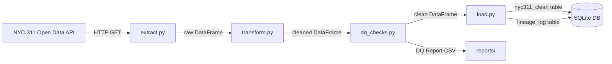
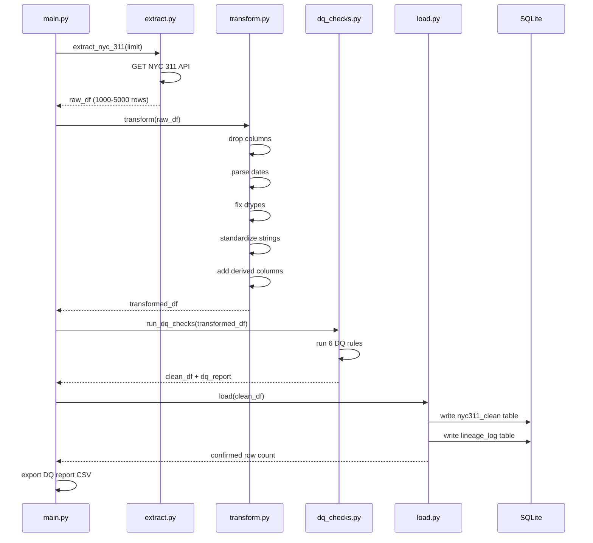
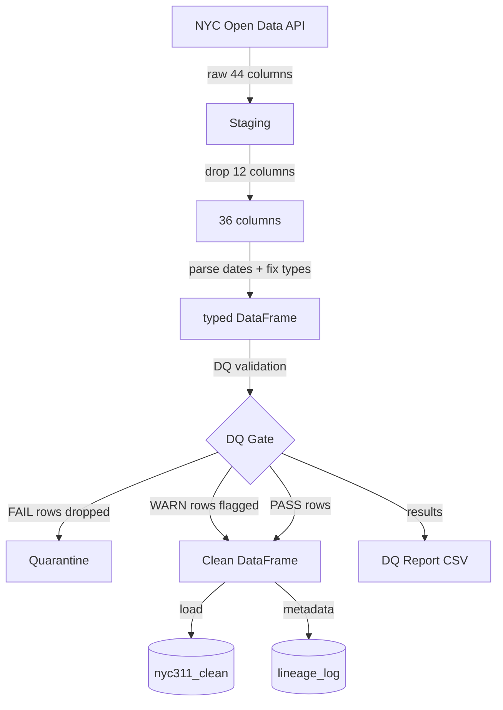

# Architecture

## Overview
This document describes the end-to-end architecture of the Data Governance Pipeline. The pipeline follows a standard ETL pattern with an embedded data quality validation layer between transform and load.

---

## System Diagram


---

## Pipeline Flow


---

## Component Breakdown

### main.py
Entry point for the full pipeline. Orchestrates all four modules in sequence, handles CLI arguments, logs pipeline summary, and exports the DQ report.

**Key responsibilities:**
- Accept `--limit` CLI argument for row count
- Call extract → transform → dq_checks → load in sequence
- Log pipeline summary (duration, rows extracted, rows dropped, DQ results)
- Export timestamped DQ report CSV to reports/

---

### extract.py
Pulls raw data from the NYC Open Data API and returns a pandas DataFrame.

**Key responsibilities:**
- HTTP GET request to NYC 311 endpoint with configurable row limit
- Error handling for connection failures, timeouts, and HTTP errors
- Schema detection and logging
- Lineage metadata logging on every extraction

**Configuration:**
```python
NYC_311_URL = "https://data.cityofnewyork.us/resource/erm2-nwe9.csv"
DEFAULT_LIMIT = 50000
```

---

### transform.py
Applies all cleaning and standardization operations to the raw DataFrame.

**Key responsibilities:**
- Drop 12 columns with 90%+ null rate
- Parse date strings to datetime objects
- Fix incorrect data types (zip as string, council_district as Int64)
- Standardize string columns (strip whitespace, title case)
- Add derived columns (resolution_hours, is_open, created_year, created_month)

**Input:** Raw DataFrame (44 columns)  
**Output:** Cleaned DataFrame (36 columns)

---

### dq_checks.py
Applies 6 governance rules to the transformed DataFrame and returns a clean DataFrame and DQ report.

**Key responsibilities:**
- Run all 6 DQ rules against transformed data
- Classify each rule result as PASS, FAIL, or WARN
- Drop rows that violate critical (FAIL) rules
- Return clean DataFrame and structured DQ report

**Input:** Transformed DataFrame (36 columns)  
**Output:** Clean DataFrame + DQ Report DataFrame

| Rule | Severity | Action on Violation |
|------|----------|---------------------|
| DQ-001 Descriptor Not Null | Critical | Drop row |
| DQ-002 Zip Code Format | Non-Critical | Flag row |
| DQ-003 Coordinate Completeness | Critical | Drop row |
| DQ-004 Open/Closed Flag Consistency | Critical | Drop row |
| DQ-005 Unique Key Integrity | Critical | Drop row |
| DQ-006 Resolution Description Consistency | Non-Critical | Flag row |

---

### load.py
Persists the clean DataFrame to SQLite and logs lineage metadata.

**Key responsibilities:**
- Write clean DataFrame to `nyc311_clean` table
- Write lineage metadata to `lineage_log` table
- Verify row count after load
- Expose `query()` helper for running SQL against the database

**Database:** `reports/nyc311.db`  
**Tables:**
- `nyc311_clean` — clean complaint records
- `lineage_log` — load event metadata

---

## Data Lineage


---

## Technology Decisions

| Decision | Choice | Rationale |
|----------|--------|-----------|
| Language | Python 3.11.5 | Industry standard for data pipelines |
| Data manipulation | pandas | Best in class for tabular data processing |
| HTTP client | requests | Simple, reliable API consumption |
| Storage | SQLite | Zero setup, portable, sufficient for portfolio scale |
| Docs site | Docusaurus | Professional UI, GitHub Pages compatible, Mermaid support |
| CI/CD | GitHub Actions | Native to GitHub, free, auto-deploys on push |

---

## Known Limitations

| Limitation | Impact | Mitigation |
|------------|--------|------------|
| SQLite not suitable for concurrent writes | Single user only | Acceptable for portfolio project |
| DQ checks run synchronously | Performance bottleneck at 500k+ rows | Tracked as R-003 in Risk Register |
| No incremental loading | Full refresh on every run | Acceptable at current scale |
| API dependency | Pipeline fails if NYC Open Data is down | Error handling in extract.py surfaces failures clearly |


